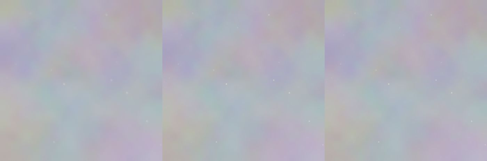

# Starless + EasySharp training status

updated 2026-07-13 05:12

queue of 4 experiments
## star_w32: ok (5.6 h)
- export: ok
- eval: {"psnr_in": 55.55, "psnr_out": NaN, "leak": NaN, "recomp": 153.21, "completeness": {"faint": 0.8964, "mid": 0.9758, "bright": 0.9724}, "panels": ["panel_DS.tif", "panel_Stacked.tif", "panel_7IV01626.tif", "panel_7IV01627.tif", "panel_(1)_20260520113330.tif", "panel_(10)_20260520113355.tif"],
## sharp_w32: ok (3.8 h)
- export: ok
- eval: {"psnr": 54.9395, "flux": 0.0389, "reblur": 0.001, "ident": 0.0007, "panels": ["sharp_DS.tif", "sharp_Stacked.tif", "sharp_7IV01626.tif", "sharp_7IV01627.tif", "sharp_(1)_20260520113330.tif", "sharp_(10)_20260520113355.tif"], "step": 80000}
## star_w64_ship: ok (17.5 h)
- export: ok
- eval: {"psnr_in": 57.73, "psnr_out": NaN, "leak": NaN, "recomp": 151.87, "completeness": {"faint": 0.9316, "mid": 0.9958, "bright": 0.9862}, "panels": ["panel_DS.tif", "panel_Stacked.tif", "panel_7IV01626.tif", "panel_7IV01627.tif", "panel_(1)_20260520113330.tif", "panel_(10)_20260520113355.tif"],
## RUNNING: sharp_w64_ship (2026-07-13 05:12)
{"step": 166800, "loss": 0.00241, "main": 0.0016, "fft": 0.00132, "grad": 0.00185, "reblur": 0.00167, "img_s": 46.3, "lr": 2.087293017590995e-05}
{"step": 167000, "loss": 0.00315, "main": 0.002, "fft": 0.00169, "grad": 0.00229, "reblur": 0.00251, "img_s": 46.3, "lr": 2.063958859149161e-05}
{"step": 167200, "loss": 0.00239, "main": 0.00161, "fft": 0.0012, "grad": 0.00159, "reblur": 0.00167, "img_s": 46.4, "lr": 2.0407528676907075e-05}

latest sample: `runs/sharp_w64_ship/samples/step0165000_s2.tif`

_panel = input | model output | ground truth (left to right)_
