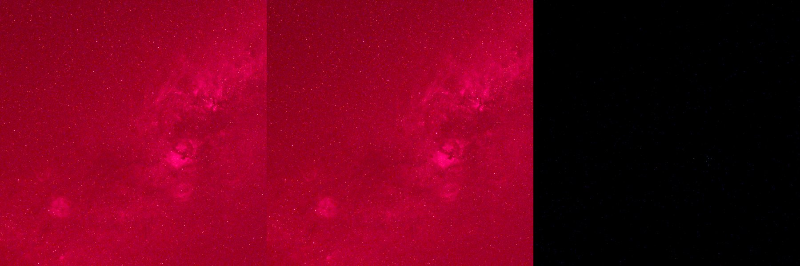
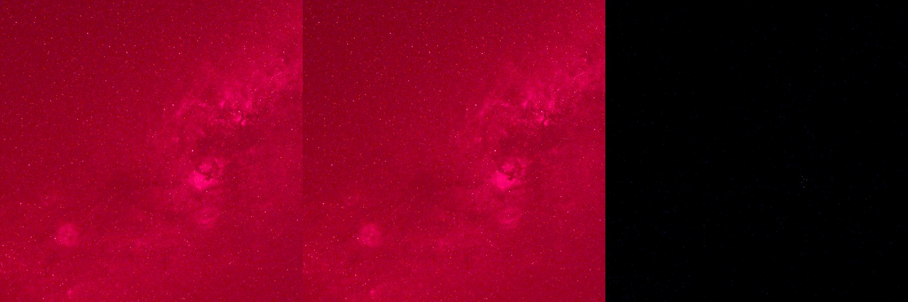
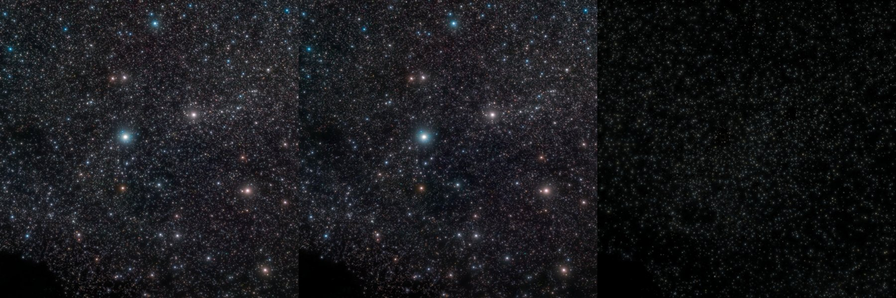
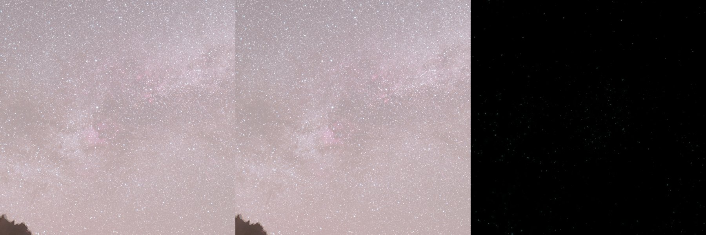
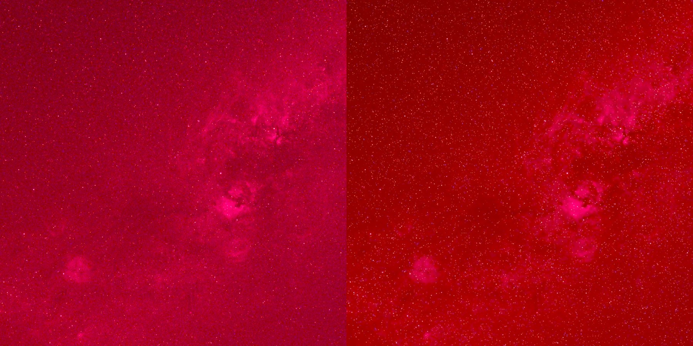
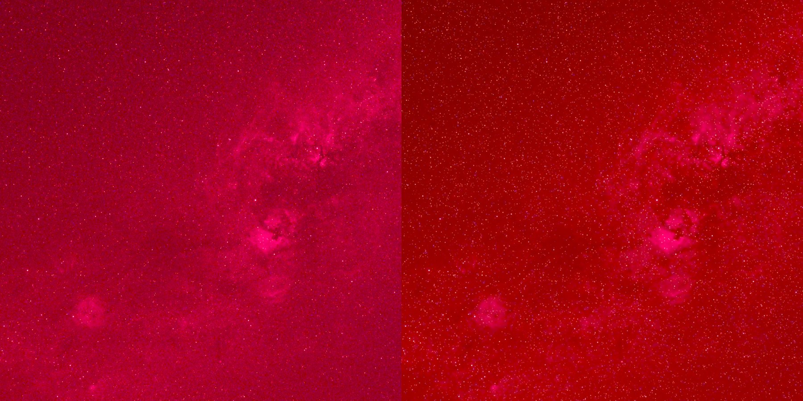
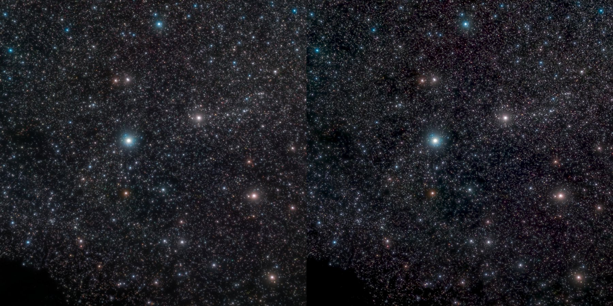
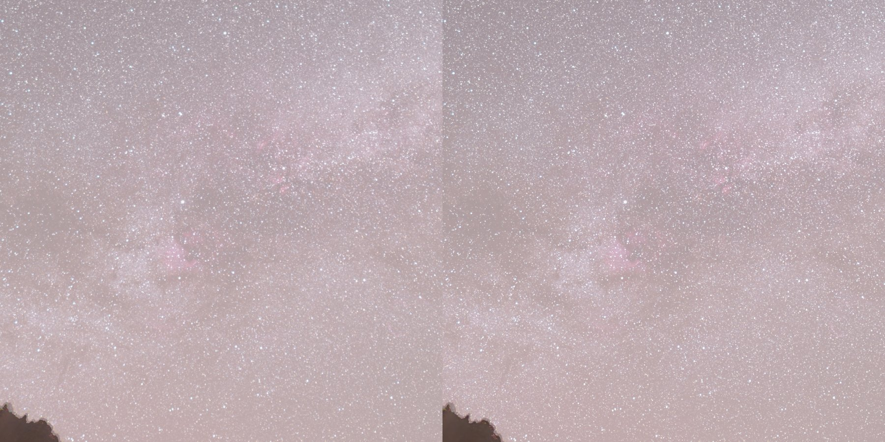

# Starless + EasySharp — training results

Trained locally on the RTX 4090. Two Siril AI tools:

- **Starless** — star removal (starless + recomposable stars layer)
- **EasySharp** — PSF-aware deconvolution / sharpening

## Star removal (completeness = fraction of star flux removed)

| model | faint | mid | bright | PSNR |
|---|---|---|---|---|
| w32 baseline | 0.8964 | 0.9758 | 0.9724 | 55.55 |
| w64 SHIP | 0.9316 | 0.9958 | 0.9862 | 57.73 |

## Deconvolution (flux err %, no-hallucination identity)

| model | PSNR | flux_err | identity |
|---|---|---|---|
| w32 baseline | 54.9395 | 0.0389 | 0.0007 |
| w64 SHIP | 56.1207 | 0.0364 | 0.0006 |

## Installed models

- `scripts/starless_w64.onnx`
- `scripts/starless_w32.onnx`
- `scripts/easysharp_w64.onnx`
- `scripts/easysharp_w32.onnx`

The Siril scripts auto-load the newest matching .onnx next to them, so Starless/EasySharp work out of the box.

## Real-frame before/after panels

In `results/panels/` — star panels are input | starless | stars; sharp panels are input | sharpened.

**Honest note:** on real frames the star model removes bright/medium stars cleanly; some faint residuals remain (a mix of missed faint stars and sensor noise). Judge against StarNet on the same frame; the next iteration is tuning the synthetic faint-star/noise recipe to match your sensor.

### star_w64_ship__panel_(1)_20260520113330.jpg

_20260520113330.jpg)

### star_w64_ship__panel_(10)_20260520113355.jpg

_20260520113355.jpg)

### star_w64_ship__panel_7IV01626.jpg

### star_w64_ship__panel_7IV01627.jpg

### star_w64_ship__panel_DS.jpg

### star_w64_ship__panel_Stacked.jpg

### sharp_w64_ship__sharp_(1)_20260520113330.jpg

_20260520113330.jpg)

### sharp_w64_ship__sharp_(10)_20260520113355.jpg

_20260520113355.jpg)

### sharp_w64_ship__sharp_7IV01626.jpg

### sharp_w64_ship__sharp_7IV01627.jpg

### sharp_w64_ship__sharp_DS.jpg

### sharp_w64_ship__sharp_Stacked.jpg

